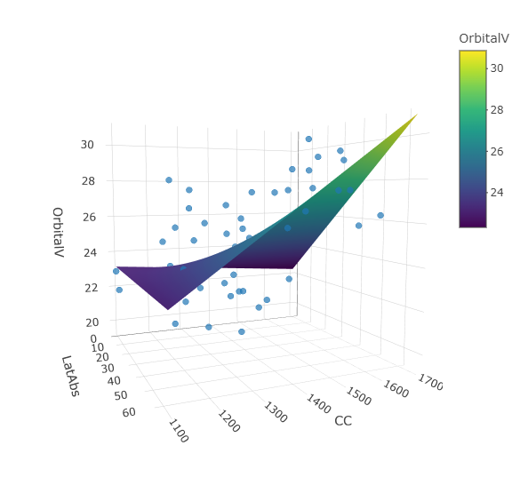

# Review of multiple linear regressions  
本章では、一般化加法モデル(GAM)の説明に入る前に、多くの人に馴染みのある重回帰分析(multiple linear regression)について説明する、なぜなら、GAMは重回帰分析を拡張したものだからである。  

## Light levels and size of the human visual system   
@Pearce2012 は、ヒトの集団が住んでいる標高と眼窩の容量に正の関連があることから、住んでいる環境の光量がヒトの視覚システムの進化の原動力になっていると結論付けた。本章ではこの論文のデータを用いて重回帰分析について説明を行う。重回帰分析でデータを探索し、モデルを構築し、モデルを当てはめ、モデル選択を行い、モデルの妥当性を確認する方法はGAMでもほとんど同じように適用できる。

## The variables  
@Pearce2012 は、オックスフォード大学博物館にある55人の成人の頭蓋骨から、頭蓋の容量(cranial capacity: CC)と眼窩容量(orbital volume)、大後頭孔(foramen magnum: FM)などの測定を行った。  

データは以下のとおりである。平均眼窩容量(mean orbital volume)が目的変数であり、それ以外の変数は説明変数である[^foot1]。`AbsoluteLatitude`と`Minimum_Tempreture_celsius`はそれぞれ  頭蓋が発見された場所の標高と最低気温、`FMarea_intercondyle`は体格の大きさを示す指標、`Minimum_Illuminance`はlogスケールで表した光の強度、`Gender`は頭蓋の性別である。  
```{r}
hvs <- read_delim("data/HVS.txt")

datatable(hvs,
          filter = "top",
          options = list(scrollX = 20))
```

[^foot1]: 説明変数(独立変数)とは、物事の原因となっている変数のこと、目的変数(応答変数)とは説明変数の影響を受けて発生した結果となっている変数のことである。今回の場合は、様々な標高など(= 説明変数)が眼窩容量(= 目的変数)に与える影響をモデリングする。  

変数名が長いので、以下のように短く変更する。  
```{r}
hvs %>% 
  rename(OrbitalV = MeanOrbitalVolume,
         LatAbs = AbsoluteLatitude,
         CC = CranialCapacity,
         Illuminance = Minimum_Illuminance,
         Temperature = Minimum_Temperature_celsius,
         FM = FMarea_intercondyle) %>% 
  mutate(fPopulation = factor(Population),
         fGender = factor(Gender)) -> hvs
```

新しい列名は以下の通り。  
```{r}
colnames(hvs)
```

## Protocol for the analysis  
いかなるデータ分析も、以下の手順に沿って行わなければならない。  

1. **Data exploration**    
外れ値がないか、多重共線性(説明変数同士の強い相関)がないか、目的変数と説明変数の関係がどうか、ゼロ過剰はないか、サンプリングの収集が時間や場所によってばらついていないか、などをチェックする必要がある。  

2. **Model application**    
1の作業で分かったことや研究仮説をもとに、適切なモデルを適用する。今回は重回帰分析を行うが、様々なモデルを適用可能である。  

3. **Check the result**    
モデルを当てはめたら、どの変数が有意な影響を持つかを調べ、そうでなかった変数についてはどうするかを考える。  

4. **Model validation**    
最後に、作成したモデルが前提を満たしているかをチェックする。満たしていれば結果の解釈や結果の作図を行い、満たしていなければモデルを改善する必要がある(GAM、GLM、GLMを使うなど)。  

## Data exploration  
まずは手順1のデータ探索を行う。データ探索については @Zuur2010 に詳しい。  

### 欠損値の確認  
まず、欠損値がないかを調べる。    
```{r}
colSums(is.na(hvs))
```

`FM`の列に1つ欠損値があるので取り除く。
```{r}
hvs_b <- na.omit(hvs)
```

### 外れ値の確認  

続いて、外れ値がないかを確認する。ここでは、連続値の説明変数(`Latitude`、`CC`、`FM`、`Illuminance`、`Temperature`)についてCleveland Dotplotを作成する。Dotplotは縦軸にサンプル番号、横軸に実際の値をとる。  

図は以下のとおりである(図\@ref(fig:fig-dotplot1))。図を見る限り、外れ値はなさそうだ。  
```{r fig-dotplot1, fig.dim = c(10,6), fig.cap = "Cleveland dotplot for covariates."}
hvs_b %>% 
  select(LatAbs, CC, FM, Illuminance, Temperature) %>% 
  mutate(sample_number = 1:n()) %>% 
  pivot_longer(cols = 1:5,
               names_to = "var",
               values_to = "values") %>% 
  ggplot(aes(x = values, y = sample_number))+
  geom_point(alpha = 1)+
  facet_rep_wrap(~var,
                 scales = "free_x")+
  labs(x = "Values of the variable", y = "Sample number")+
  theme(aspect.ratio = 1)
```

### 多重共線性の確認  
次に、多重共線性(説明変数同士の強い相関)がないかを調べる。もしあると、推定結果にバイアスが生じてしまう。    

説明変数同士の関連を調べたところ(図\@ref(fig:fig-corvar1))、`LatAbs`と`Illuminance`、`Illuminance`と`Temperature`、`Temperature`と`LatAbs`に強い相関があることが分かる。また、`CC`は男性で高い傾向があることが分かったので、`CC`と`fGender`を同じモデルに説明変数として入れない方がよさそうである(今回は`fGender`を用いない)。    
```{r fig-corvar1, fig.dim = c(8,8), fig.cap = "correlation between covariates"}
ggpairs(hvs_b %>% select(LatAbs, CC, FM, Illuminance, Temperature, fGender))
```

### 目的変数と説明変数の関係の確認  
最後に、目的変数と説明変数の関連を調べる(図\@ref(fig:fig-plotxy1))。図には局所回帰(LOESS)による回帰曲線を追加している。    

図から、`LatAbs`と`OrbitalV`の間に線形の関係がありそうだということが分かる(‘CC'も?)。`Illuminance`や`Temperature`にも同様のことがいえるが、これは変数間に強い相関があることを考えれば当然だろう。多重共線性を考慮し、@Pearce2012 にもとづいて解析では`LatAbs`を用いて`Illuminance`と`Temperature`は用いないこととする。  
```{r fig-plotxy1, fig.dim = c(10,6), fig.cap = "Relationship between explanatory variables and orbital volume (OrbitalV). A LOESS smoother was added to the plot."}
hvs_b %>% 
  select(LatAbs, CC, FM, Illuminance, Temperature, OrbitalV) %>% 
  pivot_longer(cols = 1:5,
               names_to = "var",
               values_to = "values") %>% 
  ggplot(aes(x = values, y = OrbitalV))+
  geom_point(alpha = 1)+
  facet_rep_wrap(~var,
                 scales = "free_x")+
  labs(x = "Explanatory Variables", y = "OrbitalV")+
  theme(aspect.ratio = 1)+
  geom_smooth(method = "loess", se= F, color = "grey32",
              span = 0.9)
```

## Multiple linear regression  
### Underlying statistical theory  
それでは、重回帰分析を行う。まずは説明のために説明変数が1つだけのモデル(= 単回帰)を考えよう。  

標高のみを説明変数とする単回帰モデルは以下のように実行できる。  
```{r}
M1 <- lm(OrbitalV ~ LatAbs, data = hvs_b)

summary(M1)
```

これは、実際には何をやっているのだろうか?  
`lm`関数で短回帰を実行するとき、私たちは下記のモデルを実行している。なお、$i$はサンプル番号(今回は55個の頭蓋がある)を、2行目は$\epsilon_i$が平均0、分散$\sigma^2$の正規分布に従うことを表す。   

$$
\begin{aligned}
OrvitalV_i &= \alpha + \beta\times LatAbs_i + \epsilon_i \;\; (i = 1,2,\dots, 55)\\
\epsilon_i &\sim N(0,\sigma^2)
\end{aligned}
$$

このモデルで推定するパラメータは$\alpha$、$\beta$、$\sigma$である。$\beta$は標高(`LatAbs`)が眼窩容量(`OrbitalV`)に与える影響の大きさを表し、式からわかるように標高が1増えると眼窩容量が$\beta$増えることを表す。先ほど`lm`関数で実行した結果で`Estimate`の下に書かれていた数字($22.91...と0.065...$)は$\alphaと\beta$の推定値を示しているのである。    

もし以下のように行列を定義すると、  
$$
\begin{aligned}
\mathbf{y} = 
\begin{pmatrix}
OrbitalV_1\\
OrbitalV_2\\
\vdots\\
OrvitalV_{55}
\end{pmatrix} ,
\mathbf{X} = \begin{pmatrix}
1 & LatAbs_1\\
1 & LatAbs_2\\
\vdots & \vdots\\
1 & LatAbs_{55}
\end{pmatrix}, 
\mathbf{\beta} = \begin{pmatrix}
\alpha\\
\beta
\end{pmatrix}, 
\mathbf{\epsilon} = \begin{pmatrix}
\epsilon_1\\
\epsilon_2\\
\vdots \\
\epsilon_{55}
\end{pmatrix}
\end{aligned}
$$

モデル式は以下のように書ける。  
$$
\mathbf{y = X\times\beta + \epsilon}
$$

$\mathbf{X}$はRで以下のように求められる。  
```{r}
head(model.matrix(M1))
```

パラメータは**最小二乗法(ordinary least square)**で求められる。最小二乗法は、残差の二乗和(実際の測定値と推定されたモデルによる予測値の差、ここでは$\sum_i^{55}( y_i - \alpha + \beta \times OrbitalV_i)$)が最小になるようにパラメータを推定する方法である。  

$bfmath(\beta)$の推定値は数学的に以下のように求められる。なお、$\mathbf{X^t}$は$\mathbf{X}$の転置行列を、$\mathbf{X^{-1}}$はは$\mathbf{X}$の逆行列を表す。  

$$
\mathbf{\hat{\beta}} = (\mathbf{X^t}\times \mathbf{X})^{-1} \times \mathbf{X^t} \times \mathbf{y} (\#eq:bhat)  
$$

なお、$\mathbf{\hat{\beta}}$は$\mathbf{\beta}$の推定値であることを表し、便宜的にここでは$\mathbf{\hat{\beta}} = \begin{pmatrix}a\\b \end{pmatrix}$とする。  

Rでは$\mathbf{\hat{\beta}}$を以下のように求められ、`lm`関数で推定した場合と同じ推定値が得られることが分かる。   

```{r}
X <- model.matrix(M1)
solve(t(X) %*% X) %*% t(X) %*% hvs_b$OrbitalV
```

よって、モデルによって推定された眼窩容量($\hat{y_i}$)は以下のように表せる。  

$$
Fitted OrbitalV_i = 22.930 + 0.066 \times LatAbs_i
$$

すなわち、モデルの推定値から得られた残差$e_i$は以下のように表せる。  

$$
e_i = OrbitalV_i - a + b\times LatAbs_i
$$

$\mathbf{\hat{y}} = \mathbf{X}\times \mathbf{\beta}$と書けるので、残差の行列$\mathbf{e}$は$\mathbf{H} = (\mathbf{X^t}\times \mathbf{X})^{-1} \times \mathbf{X^t}$とするとき以下のように書ける。  

$$
\mathbf{e} = \mathbf{y} - \mathbf{\hat{y}} = \mathbf{y} - \mathbf{H\times y} = \mathbf{(1-H)\times y} (\#eq:yhat)
$$

モデル式より、$\mathbf{y}$の分散共分散行列は$\sigma^2 \times \mathbf{I}$と表せるので($\mathbf{I}$は単位行列)、$\mathbf{e}$の分散共分散行列は以下のように表せる。  

$$
cov(\mathbf{e}) = \sigma^2 \times (\mathbf{1 - H})
$$

また、以下の値を標準化残差(standardized residuals)という。なお、$H_{ii}$は$\mathbf{H}$の$i$番目の対角成分を表す。    

$$
e_i ^* = \frac{e_i}{\hat{\sigma} \sqrt{(1-H_{ii})}} 
$$

もしモデルが正しいとき、標準化残差は標準正規分布に従うので、その値のほとんどは-2から2の間に収まるはずである。  

Rでは、残差と標準化残差を以下のように求められる。  

```{r}
e <- resid(M1)
estd <- rstandard(M1)
```

実際、1つのデータを除いて-2から2の範囲に収まっている(図\@ref(fig:fig-stdred))。  
```{r fig-stdred, fig.dim = c(4.5,4.5), fig.cap = "標準化残差の分布"}
data.frame(estd = estd) %>% 
  ggplot(aes(x = estd))+
  geom_histogram(binwidth = 0.3)+
  theme_bw()+
  theme(aspect.ratio = 1)+
  scale_y_continuous(breaks = seq(0,10,1))
```
<br/>  

#### 外れ値のチェック  
モデルに極端な外れ値がないかを調べるときには、LeverageとCook's distanceが用いられることが多い。  

*everageは$\mathbf{H}$の対角成分で0から1の値をとり、大きいほどそのデータポイントが結果に大きな影響を与える外れ値であることを示す。特に極端な値はないよう(図\@ref(fig:fig-leverage))。    

```{r fig-leverage, fig.dim = c(4.5,4.5), fig.cap = "Leveragevalue for each observation"}
data.frame(h = diag(H),
           n = 1:nrow(hvs_b)) %>% 
  ggplot(aes(x = n, y = h))+
  geom_col(width = 0.3)+
  theme_bw()+
  theme(aspect.ratio = 1)+
  labs(x = "sample number", y = "Leverage")
```

式\@ref(eq:yhat)より、以下のように書ける。すなわち、$i$番目の観察に対してモデルから予測される値(fitted value)は元データの観測値の加重平均であり、重みは行列$\mathbf{H}$により与えられる。  

$$
\hat{y_i} = H_{i1} \times y_1 + H_{i2} \times y_2 + \dots + H_{i55} \times y_55　(\#eq:yhat2)
$$

特に$H_{ii}$は観測値$y_i$がモデルからの予測値$\hat{y_i}$に与える影響の大きさを表している。そのため、$H_{ii}$が高いことは、その観測値がモデルの推定に大きな影響を及ぼしていることを示しているのである。  

ある観測値がモデルの推定に影響を与えている度合いを表すのがCook's distanceで、以下の式で表せる。$\hat{y_{(i)}}$は式\@ref(eq:yhat2)から$H_{ii}\times y_i$を除いたものである。また、$p$はモデルの回帰式の中のパラメータ数である。    

$$
D_i = \frac{||\hat{y_i} - \hat{y_{(i)}}||}{p \times \hat{\sigma^2}}
$$

Cook's distanceはRで以下のように取得できる。  
```{r fig-cook, fig.dim = c(4.5,4.5), fig.cap = "Cook's distance for each observation"}
D <- cooks.distance(M1)

data.frame(cookD = D,
           n = 1:nrow(hvs_b)) %>% 
  ggplot(aes(x = n, y = cookD))+
  geom_col(width = 0.2)+
  theme_bw()+
  theme(aspect.ratio = 1)+
  labs(x = "sample number", y = "Cook's distance")
```

#### 95%信頼区間と予測区間の算出  
$\mathbf{\beta}$の推定値の分散共分散行列は$\mathbf{y}$の分散共分散行列が$\mathbf{\sigma^2 \times I}$であることを考えると、式\@ref(eq:bhat)より以下のようになる。  
$$
\begin{aligned}
cov(\mathbf{\hat{\beta}}) &= \mathbf(X^t \times X)^{-1} \times \mathbf{X^t} \times cov(\mathbf{y}) \times \mathbf{X} \times (\mathbf{X^t} \times \mathbf{X})^{-1} \\
&= \sigma^2 \times (\mathbf{X^t} \times \mathbf{X})^{-1}
\end{aligned}
$$

$\hat{\beta}$の標準偏差は上式から得られる行列の対角成分の1/2乗である。この値は、`lm`関数を利用した結果(`Std. Error`の下の数値)と一致する。  
```{r}
SE <-summary(M1)$sigma * sqrt(diag(solve(t(X) %*% X)))

SE
```

95%信頼区間は、モデル式より$\beta$が正規分布に従うので以下のように求められる。  
```{r}
Z <- rbind(coef(M1) + 1.96*SE,
           coef(M1) - 1.96*SE) %>% 
  data.frame() 

rownames(Z) <- c("Upper bound", "Lower bound")

Z
```

ただし、これはサンプルサイズが十分に大きいときのみ成り立つ。実際は、$\hat{\beta}$は自由度$55-2$(サンプル数 - パラメータ数)のt分布に従うので、より正確に95%信頼区間を求めるには、1.96ではなく2.005746...を用いる必要がある。  

```{r}
qt(1- 0.05/2, df = 55-2)
```

95％信頼区間は、もし100回同様の方法で実験/観察を行ってそれぞれについて95%信頼区間を算出するとき、そのうち95個には真の値が含まれていることを表す。95%信頼区間に0が含まれていないとき、$\hat{\beta}$が有意に0とは違うということができる。    

同様に、モデルに基づいた予測値の分散共分散行列は以下のように求められ、その対角成分の1/2乗が予測値の標準誤差(SE)になる。　　

$$
cov(\mathbf{\hat{y}}) = \mathbf{X} \times cov(\mathbf{\hat{\beta}}) \times \mathbf{X^t} (\#eq:covy)
$$

予測値の95%信頼区間はある標高(`LatAbs`)に対して100回データをサンプリングすれば95個のデータが含まれる範囲を表し、予測値が自由度55-2のt分布に従うので、$予測値 ± 2.0057 \times SE$で求められる。  

一方で95%予測区間は新たにデータをサンプリングしたときにデータの95%が収まる範囲を指す。予測区間を求める際の標準誤差には式\@ref(eq:covy)に$\hat{\sigma^2}$を足したものを用いればよい。  

Rでは予測値と95%信頼区間、95%予測区間は以下のように求められる。  
```{r}
## 係数の分散共分散行列  
covbeta <- vcov(M1)
data <- data.frame(LatAbs = seq(0,65,length.out = 100))
X <- model.matrix(~LatAbs, data = data)

t <- qt(1-0.05/2, df = 55-2)
  
data %>% 
  ## 予測値
  mutate(p = X %*% coef(M1)) %>% 
  ## se(信頼区間)
  mutate(se.ci = sqrt(diag(X %*% covbeta %*% t(X)))) %>% 
  ## se(予測区間)
  mutate(se.pi = sqrt(diag(X %*% covbeta %*% t(X)) + summary(M1)$sigma^2)) %>% 
  mutate(ci_upper = p + t*se.ci,
         ci_lower = p - t*se.ci,
         pi_upper = p + t*se.pi,
         pi_lower = p - t*se.pi) -> pred
```

図示すると以下のようになる(図\@ref(fig:fig-result))。  
```{r fig-result, fig.dim = c(4.5,4.5), fig.cap = "95%信頼区間と予測区間"}
pred %>% 
  ggplot(aes(x = LatAbs, y = p))+
  geom_line()+
  geom_ribbon(aes(ymin = ci_lower, ymax = ci_upper),
              fill = "grey21", alpha = 0.5)+
  geom_ribbon(aes(ymin = pi_lower, ymax = pi_upper),
              fill = "grey72", alpha = 0.5)+
  geom_point(data = hvs_b,
             aes(y = OrbitalV))+
  theme(aspect.ratio = 1)+
  theme_bw()+
  labs(y = "OrbitalV")
```

`predict`関数を用いて簡単に求めることができる。  
```{r fig-result2, fig.dim = c(4.5,4.5), fig.cap = "95%信頼区間と予測区間(predict関数を使用)"}
predict(M1,
        newdata = data.frame(LatAbs = seq(0,65,0.2)),
        interval = "confidence") %>% 
  data.frame() %>% 
  bind_cols(data.frame(LatAbs = seq(0,65,0.2))) -> conf_M1

predict(M1,
        newdata = data.frame(LatAbs = seq(0,65,0.2)),
        interval = "prediction") %>% 
  data.frame() %>% 
  bind_cols(data.frame(LatAbs = seq(0,65,0.2))) -> pred_M1

hvs_b %>% 
  ggplot(aes(x = LatAbs, y = OrbitalV))+
  geom_line(data = conf_M1,
              aes(y = fit))+
  geom_ribbon(data = conf_M1,
              aes(y = fit, ymin = lwr, ymax = upr),
              fill = "grey21", alpha = 0.5)+
  geom_ribbon(data = pred_M1,
              aes(y = fit, ymin = lwr, ymax = upr),
              fill = "grey72", alpha = 0.5)+
  geom_point()+
  theme(aspect.ratio = 1)+
  theme_bw()
```

### Multiple linear regression  
それでは、2つ以上の変数を含めたモデリングを行う。データ探索や先行研究の知見から、モデルには`LatAbs`、`CC`、`FM`を説明変数として入れ、2変数の交互作用を全ての組み合わせについて含めた。  

$$
\begin{aligned}
OrbitalV_i &= \alpha + \beta_1 \times LatAbs_i + \beta_2 \times CC_i + \beta_3 \times FM_i \\
& + \beta_4 \times LatAbs_i \times CC_i\\
& + \beta_5 \times LatAbs_i \times FM_i \\
& + \beta_6 \times CC_i \times FM_i + \epsilon_i\\
\epsilon_i &\sim N(0,\sigma^2)
\end{aligned}
$$

### Fitting the model in R and estimate parameters  
モデルのパラメータは、先ほどと同様に`lm`関数で推定できる。推定は前節で行ったのと全く同じ方法(最小二乗法)で行う。  

```{r}
M2 <- lm(OrbitalV ~ LatAbs + CC + FM + LatAbs:CC + LatAbs:FM + CC:FM,
         data = hvs_b)
```

結果は以下の通り。`Estimate`はパラメータの推定値を、`t value`は5%水準でパラメータが有意に0と異なっているかを判断する際に用いられる。P値(`Pr(>|t|)`)を見ると、有意な変数は一つもなかった。    
```{r}
print(summary(M2), digits = 3, signif.stars = FALSE)
```

## Finding the optimal model  
さて、先ほどのモデルでは1つも有意に0と異なるパラメータ($\alpha, \beta_1 \sim \beta_6$)はなかった(= 目的変数に有意な影響を持つ説明変数変数がなかった)。このようなとき、選択肢がいくつかある。  

1. そのままのモデルを採用し、全ての交互作用が5%水準では有意ではなかったと報告する。  
2. AICを利用して古典的なモデル選択を行う。  
3. 仮説検定の結果に基づいて変数選択を行う(効果のなさそうな変数を外す)。  
4. 交互作用についてのみモデル選択を行う。  
5. 情報理論的アプローチを用い、モデル平均化などを行う(c.f., @Burnham2011 )。  

ここでは、 @Pearce2012 に従い、AICを用いたモデル選択を行うことにする。  

Rでは、`step`関数を用いることでステップワイズ法(AICが最も低くなるまで説明変数を1つずつ増減させる方法)を用いた変数選択を行うことができる。分析の結果、`LatAbs`、`CC`、これらの交互作用のみを含むモデルが最もAICが低い(= 予測精度が高い)と判断された。  
```{r}
step(M2)
```

そこで、選ばれた変数のみを用いたモデルを作成し、分析を行う。  

```{r}
M3 <- lm(OrbitalV ~ LatAbs*CC, data = hvs_b)
```

分析の結果は以下のとおりである。交互作用項の係数の推定値のP値が0.051であり、わずかに交互作用項の影響があることが示唆された?  
```{r}
print(summary(M3), digits = 3, signif.stars = FALSE)
```

## Degree of freedom  
モデルの自由度はサンプル数(55)からパラメータ数(今回は4)を引いた値なので51である。しかし、このような自由度の求め方はGAMではできない。一般に、パラメータ数は$\mathbf{H}$の対角成分の和(= trace)で求めることができる。  

$$
p = \sum_{i =1} ^{55} \mathbf{H_{ii}}
$$

確かに4になっている。  
```{r}
X <- model.matrix(M3)
H <- X %*% solve(t(X) %*% X) %*% t(X)

sum(diag(H))
```

## Model validation  
最後に、作成したモデルが前提を満たしているかをチェックする。残差には普通の残差のほかに、標準化残差、スチューデント化残差などがあるが、ここでは標準化残差を用いる。    

1. 等分散性が成り立つか (→ モデルに基づく予測値と残差をプロットする)  
2. モデルがデータに当てはまっているか (→ 残差とモデルに含まれる説明変数、モデルに含まれない説明変数の関係をプロットする)  
3. データの独立性があるか(→ 自己相関があるかを確認する)  
4. 残差が正規分布に従うかを確認する(→ QQプロットを書く)    
5. モデルへの影響が大きいデータがないか確認する(→ Cook's distanceやLeverage)  

まず、モデルによる予測値と標準化残差の関係をプロットする(図\@ref(fig:fig-fitted-resid))。このときプロットにパターンがあってはいけない(e.g., 広がっていく、ばらつきが不均等など)。もし前提を満たしていれば、0を中心に均等にばらつくはずである。図からは、明確なパターンは見られない(横軸が26~27で負の残差がほとんどないなどを除けば)。    

```{r fig-fitted-resid, fig.dim = c(4.5,4.5), fig.cap = "Standardized residuals versus fitted values to assess homogeneity"}
data.frame(fitted = fitted(M3),
           resstd = rstandard(M3)) %>% 
  ggplot(aes(x = fitted, y = resstd))+
  geom_point()+
  geom_hline(yintercept = 0)+
  theme_bw()+
  theme(aspect.ratio = 1)+
  labs(x = "Fitted values", y = "Standardized residuals")
```
<br/>  

続いて、Cook`s distanceを用いて影響の大きいデータがないか確認する。Cook's distanceは通常1を超えると影響が大きいと判断される[^foot2]。ほんもでるではそのような値をとる観測値はない(図\@ref(fig:fig-cook2))。 

```{r fig-cook2, fig.dim = c(4.5,4.5), fig.cap = "Cook's disance for each observation"}
data.frame(cook = cooks.distance(M3),
           n = 1:nrow(hvs_b)) %>% 
  ggplot(aes(x = n, y = cook))+
  geom_col(width = 0.2)+
  geom_hline(yintercept = 1, linetype = "dotted")+
  theme_bw()+
  theme(aspect.ratio = 1)+
  labs(x = "Observations", y = "Cook's distance")
```


残差の正規性は、ヒストグラムとQQプロットを基に判断される。QQプロットとは、「得られたデータ(今回の場合は標準化残差)と理論分布(今回の場合は標準正規分布)を比較し、その類似度を調べるためのグラフ」である。詳細については[こちら](https://qiita.com/kenmatsu4/items/59605dc745707e8701e0)。もし類似度が高ければ、点が直線上に乗る。そこまで大きくは外れていなさそう。    


```{r fig-qqplot, fig.dim = c(4.5,4.5), fig.cap = "QQplot for M3"}
qqnorm(rstandard(M3))
qqline(rstandard(M3))
```

[^foot2]:　より正確には、F分布の50パーセンタイルが基準になるが、多くの場合その値は1に近い[@Dunn2018]。  

続いて、(モデルに入れていない説明変数を含めた)各連続変数と標準化残差の関連を図示する(図\@ref(fig:fig-multiscatter))。いずれも関連はないようで、これは**モデルによって説明できない部分(= 残差)はこうした変数とも関連がないことを示している**。  

```{r fig-multiscatter, fig.dim = c(10,6), fig.cap = "Multiple scatterplots of the standardized residuals versus each continuous variables"}
hvs_b %>% 
  mutate(resstd = rstandard(M3)) %>% 
  select(CC, LatAbs, FM, Illuminance, Temperature, resstd) %>% 
  pivot_longer(cols = 1:5, names_to = "var", values_to = "values") %>% 
  ggplot(aes(x = values, y = resstd))+
  geom_point()+
  geom_smooth(method = "lm", color = "black")+
  facet_rep_wrap(~var, repeat.tick.labels = TRUE, scales = "free_x")+
  theme_bw()+
  theme(aspect.ratio = 1)+
  labs(x = "Explanatory variables", y = "Standardized residuals")
```
<br/>  

これは、離散的な変数についても同様のようである(図\@ref(fig:fig-multiboxplot))。    
```{r fig-multiboxplot, fig.dim = c(9,4.5), fig.cap = "Boxplot of standardized residuals versus discrete variable"}
hvs_b %>% 
  mutate(resstd = rstandard(M3)) %>% 
  select(fPopulation, fGender, resstd) %>% 
  pivot_longer(1:2, names_to = "var", values_to = "values") %>% 
  ggplot(aes(x = values, y = resstd))+
  geom_boxplot()+
  facet_rep_wrap(~var, scales = "free_x")+
  theme_bw()+
  theme(aspect.ratio = 1)+
  labs(x = "Explanatory variables", y = "Standardized residuals")
```
<br/>  

自己相関も大きくなさそうである。  
```{r, fig.dim = c(4.5,4.5)}
acf(hvs_b$OrbitalV)
```

## Model interpretation  
モデルの推定値に基づくと、眼窩容量の予測値は以下のように書ける。  

$$
OrbitalV_i = 23.23 -0.25 \times LatAbs_i -0.000058 \times CC_i + 0.00022 \times LatAbs_i \times CC_i
$$

モデルに基づく回帰平面を描くと以下のようになる(図\@ref(fig:fig-3dplot))。

```{r}
data_M3 <- crossing(LatAbs = seq(0.02,65, length.out = 100),
                    CC = seq(1100,1700, length.out = 100))

pred <- predict(M3, newdata = data_M3) %>% 
  data.frame() %>% 
  rename(pred = 1) %>% 
  bind_cols(data_M3) %>% 
  pivot_wider(names_from = CC, values_from = pred) %>% 
  select(-1) 

plot_ly(hvs_b,
        x = ~LatAbs,
        y = ~CC,
        z = ~OrbitalV,
        type = "scatter3d",
        size = 2) %>% 
  add_trace(z = as.matrix(pred),
            x = seq(0.02,65, length.out = 100),
            y = seq(1100,1700, length.out =100),
            type = "surface") -> p
```

```{r fig-3dplot, fig.cap = "Regression surface from the result of the model", out.width = "85%"}
 
```

## What to do if things go wrong  
もしモデルが前提を満たさなかったらどうすればよいだろうか?本節では特にどのようなときにGAMを適用すべきかを解説する。  

等分散性の仮定が満たされないとき、以下の選択肢を検討する必要がある。  

1. 目的変数に変数変換を施す  
2. 一般化最小二乗法(GLS)を用いる  
3. さらに説明変数や交互作用を加える  
4. 目的変数の分布として他の分布を用いる(ガンマ分布など)  

3つ目の選択肢において、非線形のパターンも許容するように拡張すると、GAMが使えるようになる。これは、残差と説明変数が何らかのパターンを示した時にも有効である(= 関係が線形でない可能性があるため)。    

